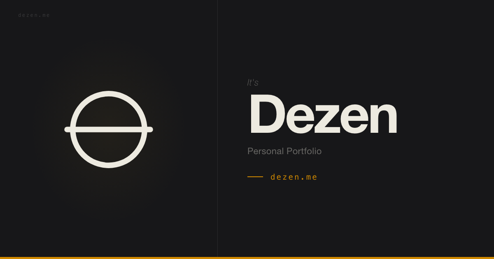

 

<h3 align="center">Hi, I'm Trung Tran Duy (Dezen)</h3>

  <strong>Fullstack Engineer</strong> from <strong>Hanoi, Vietnam</strong>

  Building scalable products, developer tools, and high-performance systems across web and backend.

  TypeScript • React • Next.js • Python • Go • Rust • Tauri

 

<h3 align="center">Tech Stack</h3>

 

  

 

<h3 align="center">Development Workflow</h3>

 

  

  <strong>AI-assisted coding workflow</strong> 
  Claude Code • Codex • Neovim (LazyVim) • Starship • mise

 

<h3 align="center">GitHub Stats</h3>

 

 

<h3 align="center">Connect With Me</h3>

 

  

 

  

